<div align="center">


<p>
  
  
  
</p>

</div>

---

<div align="center">

</div>

---

## 🪖 PERSONNEL FILE

```ascii
╔══════════════════════════════════════════════════════════════╗
║                      SERVICE RECORD                          ║
╚══════════════════════════════════════════════════════════════╝
```

```yaml
POST:           4th Year — B.Tech, Computer Science & Artificial Intelligence
DIVISION:       Backend Systems & Security
SPECIALIZATION: Java | Spring Boot | MongoDB | REST APIs | Authentication
STATUS:         Actively deploying to production-grade challenges
```

---

## 🎯 OPERATIONS LOG

```diff
+ 🛡️ PROJECT SENTRY — WACIIS 2025 (IHCI 2025)
  → Forensic surveillance framework: SHA-256 validation + AI-driven threat detection
  → Tamper-resistant event logging, modular anomaly-detection backend
  → Research poster presented at national forum

+ ⚡ BACKEND DEVELOPER INTERN — Hindustan Times Digital Streams
  → OTP-based login/registration built on Spring Boot + MongoDB
  → JWT authentication hardened with SHA-256 hashing
  → Modular REST APIs — Controller–Service–Repository–DTO architecture
  → Agile delivery: Postman-tested endpoints, tracked in JIRA

+ 🧭 SUMMER INTERN — Deloitte
  → 2-month engagement on live enterprise engineering initiatives
  → Cross-functional collaboration in a structured delivery environment

+ 🚁 AI-BASED DISASTER RESCUE DRONE — e-Yantra, IIT Bombay (Round 2 Qualifier)
  → Navigation logic + situational-detection modules

+ 🤝 CONTENT DEVELOPMENT CHAIR — IEEE Student Chapter, Banasthali Vidyapith
  → Leading technical documentation and outreach coordination
```

---

## 🛠️ TECH ARSENAL

<div align="center">

<table>
  <tr>
    <td align="center" width="96"><br>Java</td>
    <td align="center" width="96"><br>Spring Boot</td>
    <td align="center" width="96"><br>MongoDB</td>
    <td align="center" width="96"><br>JavaScript</td>
    <td align="center" width="96"><br>HTML5</td>
    <td align="center" width="96"><br>CSS3</td>
  </tr>
  <tr>
    <td align="center" width="96"><br>Git</td>
    <td align="center" width="96"><br>GitHub</td>
    <td align="center" width="96"><br>Postman</td>
    <td align="center" width="96"><br>JIRA</td>
    <td align="center" width="96"><br>Python</td>
    <td align="center" width="96"><br>React</td>
  </tr>
</table>


</div>

---

## 📊 MISSION METRICS

<div align="center">


</div>

---

## 🏅 TROPHY CASE

<div align="center">

</div>

**Decorations:**
- 🎖️ National Participant — Smart India Hackathon 2025 (Ministry of Agriculture project; advanced to Nationals, top 0.7% of colleges)
- 🎖️ Selected Participant — India AI Impact Summit 2026, Bharat Mandapam
- 🎖️ Round 2 Qualifier — e-Yantra, IIT Bombay

---

## 🐍 THE HUNT

<div align="center">

</div>

---

## 🗺️ ISOMETRIC OPERATIONS MAP

<div align="center">

</div>

---

## 📈 ACTIVITY HEATMAP

<div align="center">

</div>

---

## 📡 COMMS CHANNEL

<div align="center">

<a href="https://linkedin.com/in/anshikas-6605892ab"></a>
<a href="https://github.com/theanshikasharma"></a>

<br><br>


</div>

---

<div align="center">

```ascii
╔════════════════════════════════════════════════════════════╗
║   "Build with precision. Secure with discipline."          ║
╚════════════════════════════════════════════════════════════╝
```


</div>
